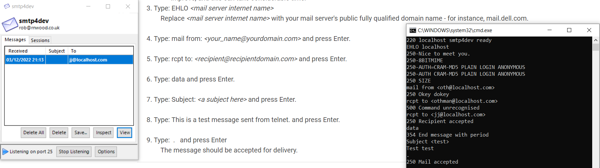

## 1 : smtp4dev
- install smtp4dev using choco : choco install smtp4dev
- Or https://github.com/rnwood/smtp4dev/wiki/Installation (docker, installer ...)
### tester la version desktop ou vous pouvez regardez aussi la version web :)
 

docker pull rnwood/smtp4dev:v3

docker run --name smtpLocal -p 25:25 -p 5001:80 -p 143:143 rnwood/smtp4dev:v3

## 2 : mailslurper
- install it by using docker :
  docker run -it -p 2500:2500 -p 8080:8080 -p 8085:8085 --rm /docker-mailslurper
- Or download it here : https://github.com/mailslurper/mailslurper/releases/tag/1.14.1

- entrer http://localhost:8080

## 3 maildev
docker run -p 1080:1080 -p 1025:1025 maildev/maildev
https://github.com/maildev/maildev

# of course exists other systems for smtp local server for developers :)